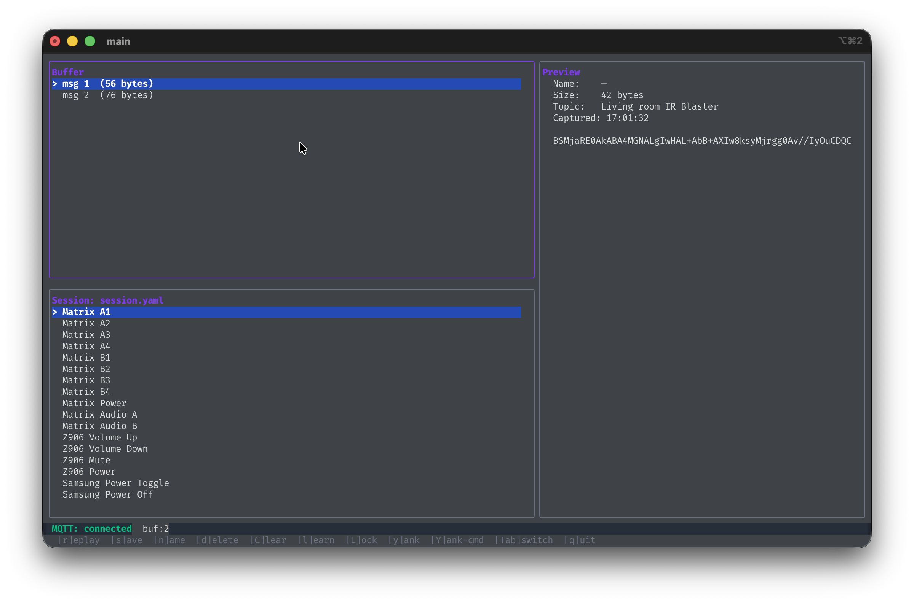

# irlearn

> A terminal-based IR code capture and replay tool for Zigbee2MQTT IR blasters.

Organise commands into named sessions, replay them on demand, and script headless capture into your automation pipelines — all from the terminal.



## Disclaimer

This project is not affiliated with or endorsed by the Zigbee2MQTT team. It is an independent tool built on top of the MQTT interface provided by Zigbee2MQTT-compatible IR blasters.

This was made to scratch my own itch and is provided as-is. Most likely, it will go unmaintained since it was used just once to capture a few codes for my media devices. However, if you find it useful and want to contribute, feel free to open issues or submit pull requests.

## Quick Start

```bash
# Build
go install github.com/dadao/zigbee2mqtt-ir-blaster-learner@latest

# Launch the TUI (pass --login if your MQTT broker requires authentication)
irlearn ui
```

All config values can also be passed as flags — run `irlearn --help` for the full list.

**Note:** Configuration will be optionally saved to `~/.config/mqttirlearn/config.yaml` after the first run.

## Features

- **Live capture** — receives IR codes the moment your device learns them
- **Session management** — group commands into named YAML files (e.g. `my-tv.yaml`)
- **Instant replay** — test any captured code directly from the TUI
- **Lock mode** — hands-free loop: auto-resends the learn command after each capture
- **Headless capture** — `irlearn capture` prints the base64 code to stdout for scripting
- **Flag overrides** — any config value can be overridden per-invocation without editing files

## Documentation

| Document                              | Audience                                                          |
|---------------------------------------|-------------------------------------------------------------------|
| [Usage Manual](docs/USAGE_MANUAL.md)  | End users — setup, TUI guide, keyboard shortcuts, troubleshooting |
| [Architecture](docs/ARCHITECTURE.md)  | Developers — package map, data flow, dependency injection         |
| [Feature Reference](docs/FEATURES.md) | Quick reference — MQTT payloads, session schema                   |

## License

MIT
