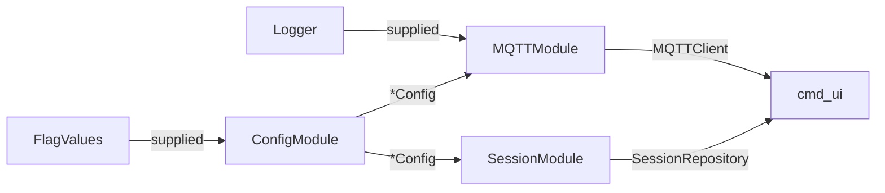
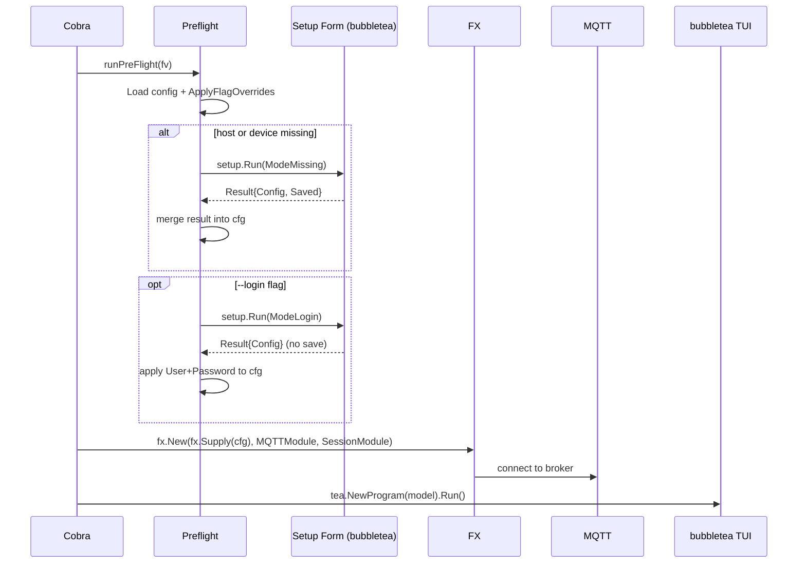
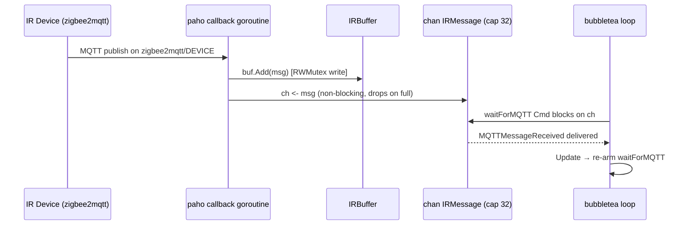
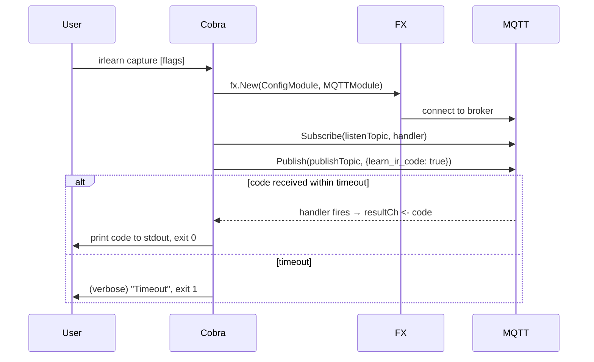
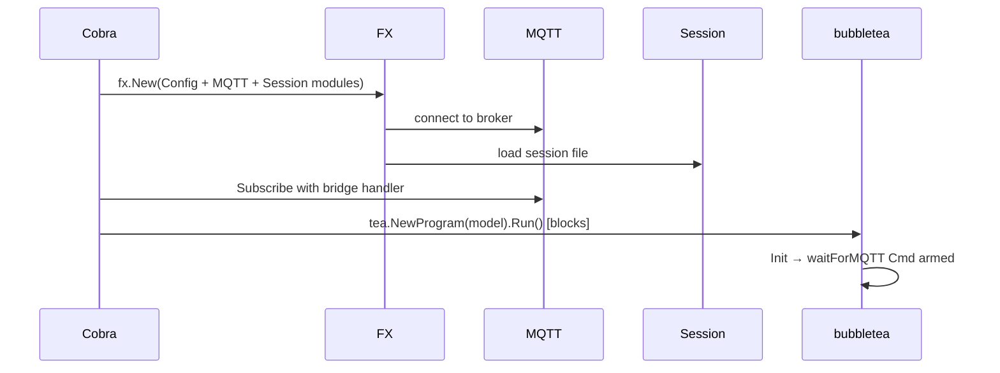
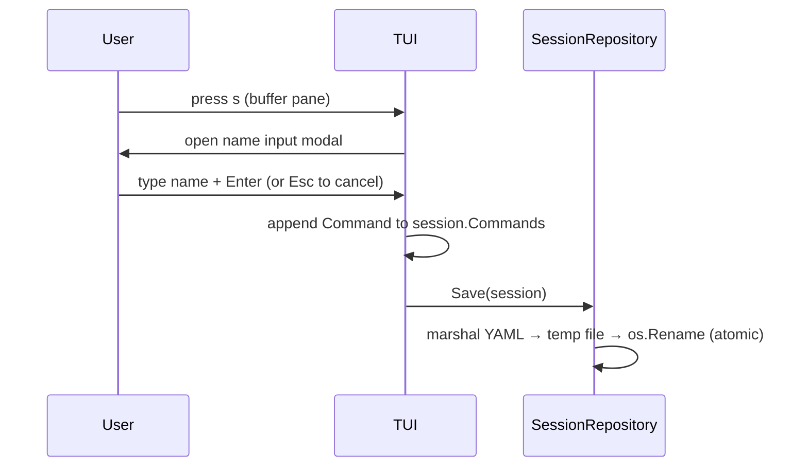
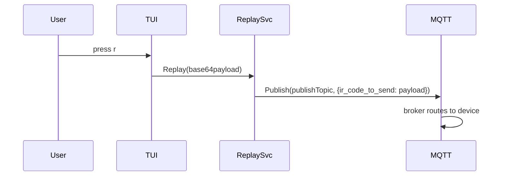

# Architecture

Developer guide to the internals of `irlearn`.

---

## Stack

| Component            | Library                                                         |
|----------------------|-----------------------------------------------------------------|
| Language             | Go (see `go.mod` for exact version)                             |
| CLI framework        | [Cobra](https://github.com/spf13/cobra)                         |
| Dependency injection | [Uber FX](https://github.com/uber-go/fx)                        |
| TUI framework        | [bubbletea](https://github.com/charmbracelet/bubbletea)         |
| TUI styling          | [lipgloss](https://github.com/charmbracelet/lipgloss)           |
| MQTT client          | [paho.mqtt.golang](https://github.com/eclipse/paho.mqtt.golang) |
| Config parsing       | [yaml.v3](https://gopkg.in/yaml.v3)                             |
| Logging              | `log/slog` (stdlib)                                             |

---

## Package Map

```
.
├── main.go                         Entry point; calls cmd.Execute()
├── cmd/                            Cobra commands (transport layer)
│   ├── root.go                     Persistent flags, logger setup, FX wiring helpers
│   ├── preflight.go                Shared pre-flight helper (config load + setup form)
│   ├── config.go                   `irlearn config` — interactive config editor
│   ├── capture.go                  `irlearn capture` — headless single-shot capture
│   └── ui.go                       `irlearn ui` — launches bubbletea TUI
│
└── internal/
    ├── flags/                      FlagValues value object
    │   └── flags.go                Shared type used by cmd and config (avoids circular import)
    ├── config/                     Config struct, YAML loader, flag override logic, FX module
    │   ├── config.go               Load (port default 1883) + Save (atomic write)
    │   ├── loader.go               ApplyFlagOverrides (exported)
    │   └── module.go
    ├── mqtt/                       MQTTClient interface, paho implementation, topic helpers, FX module
    │   ├── client.go               Interface + MessageHandler type
    │   ├── paho.go                 Paho-backed implementation
    │   ├── topics.go               ListenTopic / PublishTopic helpers
    │   └── module.go
    ├── buffer/                     Thread-safe in-memory ring of received IR messages
    │   └── buffer.go
    ├── session/                    Session model, repository interface, YAML implementation, FX module
    │   ├── model.go
    │   ├── repository.go
    │   ├── yaml_repository.go
    │   └── module.go
    ├── service/                    Business logic (learn, replay)
    │   ├── learn.go                LearnService — sends learn-mode command, tracks lock state
    │   └── replay.go               ReplayService — publishes IR code to device
    └── tui/                        bubbletea model, update loop, view rendering
        ├── model.go
        ├── update.go
        ├── view.go
        ├── messages.go             MQTTMessageReceived, StatusChanged, LoginSubmitted, LoginDismissed
        ├── prompt.go               Single-line text input widget (used by modals)
        ├── login_modal.go          Credentials overlay (User + Password fields)
        ├── input_modal.go          Name input overlay (used for save and rename flows)
        ├── styles.go               (thin shim, imports tui/styles)
        ├── styles/                 Shared lipgloss styles — own leaf package
        │   └── styles.go           (avoids tui ↔ panes circular import)
        ├── setup/                  Standalone setup form — leaf package, no tui import
        │   ├── field.go            Field input widget
        │   ├── model.go            Form model (ModeMissing / ModeFull / ModeLogin)
        │   └── run.go              Run() entry point
        └── panes/                  Individual pane renderers
            ├── buffer_pane.go
            ├── session_pane.go
            └── preview_pane.go
```

### Why `internal/flags` is a separate package

`cmd` imports `internal/config` to build the FX container. `internal/config` needs to read
flag values to apply overrides. If `config` imported `cmd` to access the flag struct, a cycle
would form. `internal/flags` is a leaf package with no imports from this module, breaking the
cycle: `cmd` ← `internal/config` ← `internal/flags`.

### Why `internal/tui/styles` is a sub-package

`internal/tui` and `internal/tui/panes` mutually need shared style constants. Defining them
in either package would create a cycle. `styles` is a pure-value leaf that both can import.

---

## Key Interfaces

### `mqtt.MQTTClient`

```go
type MQTTClient interface {
    Subscribe(topic string, handler MessageHandler) error
    Publish(topic string, payload []byte) error
    IsConnected() bool
}
```

No paho types leak through. The interface is small enough to mock trivially in tests.

### `session.SessionRepository`

```go
type SessionRepository interface {
    Load(path string) (*Session, error)
    Save(sess *Session) error
}
```

The YAML implementation writes atomically: marshal → `os.CreateTemp` → write → `os.Rename`.
This prevents a partial file on crash.

### `buffer.IRBuffer`

A concrete struct (not an interface) protected by `sync.RWMutex`. Only one implementation
exists and none is anticipated, so an interface would be premature.

---

## Dependency Injection (FX)

FX is used only in the `cmd` layer. Services below that are constructed manually after
`fx.Populate` extracts the wired dependencies.



`cmd/capture.go` uses only `ConfigModule` + `MQTTModule`. `cmd/ui.go` adds `SessionModule`.

---

## Config Loading Order

1. Resolve config file path: `--config` flag → default `~/.config/mqttirlearn/config.yaml`
2. Parse YAML into `config.Config` (missing file is not an error — yields struct with Port=1883)
3. Apply flag overrides: only flags that were explicitly set on the command line win
   (tracked via `cobra.Command.Flags().Visit`)
4. **Pre-flight check**: if `host` or `device` is empty, show the setup form before connecting
5. Supply the resolved `*config.Config` directly to FX (`fx.Supply`) instead of `config.Module`,
   so form-collected values are not discarded by a second load

## UI Startup Flow (with pre-flight)



---

## MQTT Message Flow



---

## Capture Command Flow



---

## UI Startup Flow



---

## Save Flow



---

## Replay Flow



---

## Thread Safety Model

Two concurrent boundaries exist:

1. **paho callback goroutine** — writes to `IRBuffer` (guarded by `sync.RWMutex`) and sends
   to `chan IRMessage` (non-blocking; drops on full with a warning log).

2. **bubbletea event loop** — single-threaded by design. It reads from the buffer only via
   the `MQTTMessageReceived` message delivered through `waitForMQTT`, so no additional
   locking is needed on the read path.

The channel acts as the safe handoff point between the two goroutines.

---

## Session Persistence

The YAML repository writes atomically to prevent corrupt files on crash:

1. `yaml.Marshal` the session into memory
2. `os.CreateTemp` in the same directory as the target path
3. Write marshalled bytes to the temp file
4. `os.Rename` temp → target (atomic on POSIX; same filesystem guaranteed by same-dir temp)
