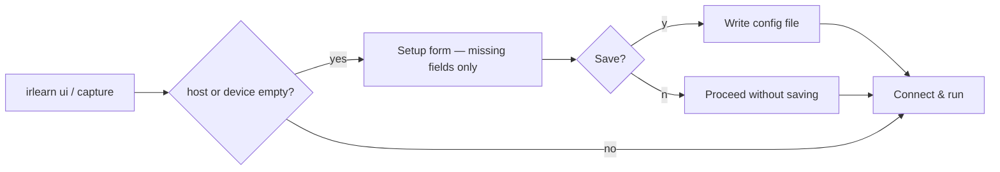

# IR Blaster Learner — Feature Reference

## Overview

A terminal UI CLI tool for learning and replaying IR codes via a zigbee2mqtt-connected IR blaster device. The app connects to an MQTT broker, listens for learned IR payloads, lets the user organise them into named sessions, and can replay any command back to the device.

---

## TUI Layout

```
┌─────────────────────────────┬──────────────────────┐
│  Buffer                     │  Preview             │
│  > msg 1  (42 bytes)        │  Name: —             │
│    msg 2  (38 bytes)        │  Bytes: 42           │
│    msg 3  (42 bytes)        │  Hex: 4A 2B 00 FF …  │
├─────────────────────────────┤                      │
│  Session: my-tv.yaml        │                      │
│  > power                    │                      │
│    volume_up                │                      │
│    mute                     │                      │
└─────────────────────────────┴──────────────────────┘
│ MQTT: connected  [r]eplay [s]ave [d]elete [c]lear  │
│ :                                                  │
└────────────────────────────────────────────────────┘
```

- **Left top**: Buffer pane — live stream of received IR codes
- **Left bottom**: Session commands pane — commands saved to the current session file
- **Right**: Preview pane — byte length and hex preview of the selected item
- **Bottom bar**: MQTT connection status + keyboard hint strip
- **Prompt line**: Vim-style `:` prompt used when naming commands

For keyboard shortcuts and a full operational guide, see [USAGE_MANUAL.md](USAGE_MANUAL.md).

---

## Session YAML Schema

```yaml
device: living_room_tv
commands:
  - name: power
    payload: <base64>
    captured_at: 2024-01-01T00:00:00Z
  - name: volume_up
    payload: <base64>
    captured_at: 2024-01-01T00:00:01Z
```

---

## MQTT Payload Reference

For topic names and connection details, see [ARCHITECTURE.md](ARCHITECTURE.md).

### Learned IR code message from device

```json
{
  "learned_ir_code": "base64-encoded-bytes",
  "other_device_data": "..."
}
```

Only the `learned_ir_code` key is processed; all other fields are ignored.

### Enable learning mode command

```json
{
  "learn_ir_code": true
}
```

### Replay command

```json
{
  "ir_code_to_send": "base64-encoded-bytes"
}
```

---

## Setup & Login Flow

### First-run setup form

When `host` or `device` is missing from the config, a full-screen setup form appears before
the TUI starts. Only the missing fields are shown. After filling them in you can optionally
save the values to the config file.



### `irlearn config`

Opens the full configuration form at any time to review or update all five settings
(host, port, device, user, password).

### `--login` flag

- **`irlearn ui --login`**: shows a credentials-only form (User + Password) before the TUI
  starts. Values are not saved to disk.
- **`irlearn capture --login`**: prompts for credentials via stdin before connecting.

## Out of Scope (v1)

- IR protocol decoding (NEC, RC5, etc.)
- In-app session file picker
- Multiple device support
